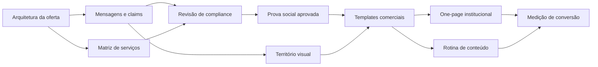
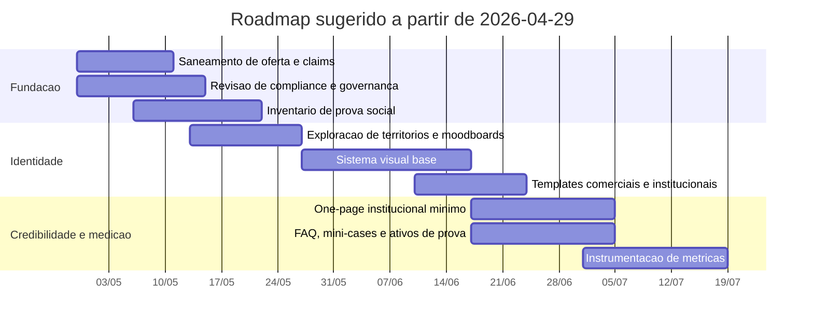
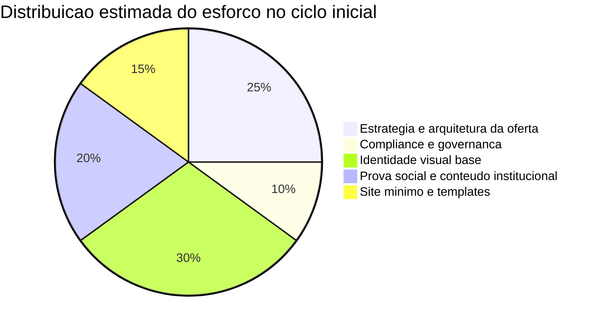

# Relatório analítico dos briefings da Variantmidia

## Resumo executivo

A leitura cruzada dos anexos mostra que a Variantmidia não está se descrevendo como uma agência de marketing “tradicional”, mas como uma operação de **performance jurídica orientada por diagnóstico**, cujo núcleo é encontrar gargalos em **Oferta → Demanda → Conversão**, estruturar atendimento e comercial, aplicar tecnologia de forma assistiva e responder por faturamento, previsibilidade e ROI. O briefing de público-alvo é a fonte estratégica dominante: ele detalha proposta de valor, dores, objeções, diferenciais, ambição de payback, fragilidades de credibilidade digital e o papel da IA humanizada. Já o briefing de identidade visual funciona como uma camada de preferência estética, confirmando direção “performance + tecnologia + premium”, preferência por azul e branco, uso contido de neon e limite de até três cores protagonistas. O memorando de escopo reforça que a prioridade deve ser **identidade visual antes do PRD do site**. (Fonte interna: Briefing Público-Alvo, p. 2-14; Briefing de Identidade Visual, p. 1-2; memorando de escopo, l. 24-29 e 142-248.)

O maior valor estratégico do material não está em “criar um logo bonito”, e sim em traduzir uma tese comercial mais específica: a Variantmidia quer parecer uma empresa que **mede, diagnostica e corrige perdas de receita em escritórios de advocacia**, e não uma agência criativa genérica. Isso é sustentado por quatro sinais fortes dos próprios anexos: diagnóstico antes da prescrição, foco em faturamento e não em métricas de vaidade, domínio das restrições éticas do mercado jurídico e defesa de uma jornada comercial de ponta a ponta. (Fonte interna: Briefing Público-Alvo, p. 2, 5-6, 11-14; memorando de escopo, l. 30-91.)

Os riscos mais relevantes também já aparecem nos documentos. Há inconsistências de narrativa entre “da geração de demanda até a indicação” e “do primeiro contato até o contrato assinado”; a promessa temporal oscila entre “ROI em 45 dias em média” e “em média entre 45 e 60 dias o projeto já cobre o investimento”; existe menção a “mais de 300 escritórios atendidos”, mas sem lastro documental anexado; e a própria marca admite perda de confiança por falta de site, presença social insuficientemente convincente e prova social ainda pouco organizada. Em paralelo, há lacunas objetivas: orçamento, tamanho de equipe, prazo do projeto, arquitetura detalhada de serviços, nichos jurídicos prioritários e critérios formais de aprovação de claims permanecem **não especificados**. (Fonte interna: Briefing Público-Alvo, p. 5-6, 11-14.)

Do ponto de vista regulatório, o ambiente do cliente final exige sobriedade. O marco oficial do marketing jurídico no Brasil continua assentado no Provimento 205/2021 e no Código de Ética: publicidade profissional deve ser meramente informativa, discreta e sóbria; captação de clientela, mercantilização, autoengrandecimento e chamadas ostensivas de contratação seguem vedados. Ao mesmo tempo, o sistema OAB admite presença digital, links de contato, anúncios pagos em caráter informativo e chatbot como ferramenta auxiliar, desde que a pessoalidade do serviço jurídico não seja descaracterizada. Como a própria OAB instalou um grupo de trabalho em 2025 para revisar o Provimento 205/2021, a governança de compliance precisa entrar no plano desde o início. citeturn3view0turn3view1turn3view2turn3view3turn7view0turn4view0

A recomendação central deste relatório é objetiva: trabalhar a identidade da Variantmidia a partir do território **Precisão Diagnóstica**, com uma camada secundária de **Autoridade Editorial**. Em termos práticos, isso significa priorizar clareza, método, sofisticação, confiança operacional, linguagem visual modular e evidência antes de espetáculo. O plano sugerido para os próximos 90 dias é: saneamento de narrativa e claims, organização de prova social e compliance, definição do sistema verbal e visual, criação de ativos mínimos de credibilidade e só então expansão de site e rotina de conteúdo. (Fonte interna: Briefing Público-Alvo, p. 2, 5-6, 11-14; Briefing de Identidade Visual, p. 1-2; memorando de escopo, l. 80-91, 124-248.)

## Catálogo documental

Foram identificados **dois PDFs de briefing** e **um documento complementar de escopo**. Não há, entre os anexos recebidos, outros PDFs além dos dois briefings explicitamente nomeados no memorando. A grafia da marca aparece de forma consistente como **Variantmidia**; não encontrei, nos arquivos anexos, evidência de uso oficial concorrente de “Variant Media”. (Fonte interna: Briefing Público-Alvo, p. 1-2; memorando de escopo, l. 5-8 e 22.)

| Documento | Tipo | Link | Papel analítico | Situação |
|---|---|---|---|---|
| Briefing Público-Alvo / Onboarding | PDF | [Abrir PDF](sandbox:/mnt/data/variantmidia_briefing_publico_alvo.pdf) | Fonte primária principal para proposta de valor, dores, desejos, objeções, diferenciais, stakeholders e KPIs declarados | Forte, detalhado e estrategicamente decisivo |
| Briefing de Identidade Visual | PDF | [Abrir PDF](sandbox:/mnt/data/variantmidia_briefing_identidade_visual.pdf) | Fonte primária complementar para tom, sensações, paleta e restrições visuais | Útil, porém curto e parcialmente genérico |
| Memorando de escopo | TXT | [Abrir arquivo](sandbox:/mnt/data/variantmidia_escopo.txt) | Documento de instrução: define foco em identidade visual, benchmark, moodboard e prompts | Complementar, não substitui os briefings |

## Análise detalhada dos briefings

A assimetria entre os dois briefings é importante: o onboard de público-alvo é um documento de posicionamento e negócio; o briefing visual é um documento de preferência e direção estética. Quando houver tensão entre eles, o primeiro deve prevalecer, porque carrega mais contexto estratégico. Um sinal disso é o texto introdutório genérico do briefing visual, que fala em “atrair os alunos certos” e “se destacar na sua região”, fórmula incompatível com uma empresa B2B de performance jurídica. (Fonte interna: Briefing Público-Alvo, p. 2-14; Briefing de Identidade Visual, p. 1.)

| Campo | Briefing Público-Alvo / Onboarding | Implicação executiva | Evidência |
|---|---|---|---|
| Objetivo | Explicar o que a empresa vende, quais problemas resolve, para quem vende, contra quem concorre e como quer ser percebida | É o documento-base para a narrativa da marca | Onboarding, p. 2-6 |
| Objetivos declarados | Foco em faturamento, ROI, previsibilidade, jornada de compra e diagnóstico de gargalos | A marca deve comunicar impacto operacional, não “criatividade publicitária” | Onboarding, p. 2, 5-6 |
| Público-alvo | Sócios e responsáveis por escritórios de advocacia com dependência de indicação, atendimento lento, baixa previsibilidade e processo comercial informal | O discurso precisa falar com dono de operação e não com “gestor de marketing” | Onboarding, p. 3, 7-10 |
| Problemas centrais | Dependência de indicação, receita imprevisível, leads pouco qualificados, demora de atendimento, baixa escala, falta de filtro, ausência de diagnóstico, comercial informal | Sistema de marca deve parecer solução de controle e método | Onboarding, p. 3, 7-9 |
| Desejos do público | Agenda cheia com clientes certos, previsibilidade de faturamento, múltiplas fontes de demanda, crescimento sem dependência do sócio e autoridade de nicho | O repertório visual precisa combinar segurança com crescimento disciplinado | Onboarding, p. 9-10 |
| Diferenciais declarados | Especialização em advocacia, entendimento das restrições éticas, metodologia ponta a ponta, IA humanizada, ausência de multa rescisória, foco em ROI | “Especialização jurídica” sozinha não basta; o diferencial verdadeiro é a combinação com sistema comercial e diagnóstico | Onboarding, p. 5-6 |
| Requisitos principais | Diagnóstico antes da prescrição; leitura do triângulo Oferta–Demanda–Conversão; linguagem de faturamento; transparência sobre resultados | Necessário criar um sistema verbal e visual baseado em método e evidência | Onboarding, p. 2, 5-6, 11-14 |
| Restrições percebidas | Não parecer agência generalista, não reduzir a atuação a anúncios, não soar robótico, não prometer resultado garantido | A identidade deve equilibrar performance e sobriedade | Onboarding, p. 4-6, 11-14 |
| Entregáveis implícitos | Diagnóstico, proposta consultiva, estrutura comercial, IA de atendimento, ajustes de demanda e conversão, acompanhamento do dono | O escopo real parece maior do que “marketing”; é preciso reescrever a arquitetura da oferta | Onboarding, p. 2, 5-6, 14 |
| KPIs declarados | “ROI em 45 dias em média”; “em média entre 45 e 60 dias o projeto já cobre o investimento”; melhora de conversão, tempo de resposta, previsibilidade e qualificação | Os KPIs precisam ser normalizados e operacionalizados em métricas auditáveis | Onboarding, p. 5, 11-12 |
| Stakeholders | Fundador/dono, equipe operacional, prospects jurídicos, clientes céticos, equipe de atendimento/IA, design/site, fontes de prova social | O projeto não é só de design; exige coordenação entre estratégia, conteúdo, compliance e operação | Onboarding, p. 11-14 |
| Prazos | **Não especificado** | É necessário estabelecer um cronograma proposto | Ausência no documento |
| Orçamento | **Não especificado** | Deve ser trabalhado em faixas de escopo | Ausência no documento |
| Tamanho de equipe | **Não especificado** | Recomenda-se modelagem enxuta e modelagem ideal | Ausência no documento |

| Campo | Briefing de Identidade Visual | Implicação executiva | Evidência |
|---|---|---|---|
| Objetivo | Definir tom inicial da identidade, sensações desejadas e preferências de cor | Documento útil para estética, mas insuficiente para posicionamento isolado | Identidade visual, p. 1-2 |
| Personalidade desejada | Focada em performance, moderna, premium | A marca deve parecer eficiente e contemporânea, não “fofa”, artesanal ou genérica | Identidade visual, p. 1 |
| Sentimento do logo | Performance e tecnologia | O símbolo e o wordmark devem sugerir método e precisão, não ornamento | Identidade visual, p. 1 |
| Preferências cromáticas | Azul claro ou escuro; branco como base; tons neon com moderação | Paleta deve manter sofisticação e evitar saturação excessiva | Identidade visual, p. 1-2 |
| Restrição cromática | Até três cores protagonistas, com boa combinação | Bom limitador para preservar memória e consistência | Identidade visual, p. 2 |
| Aplicações previstas | Opções de uso em digital e impresso aparecem no formulário, mas a exportação do PDF não permite confirmar a seleção | Uso final deve ser tratado como **não especificado** e coberto em ambas as frentes | Identidade visual, p. 2 |
| Entregáveis implícitos | Logo, sistema visual e versões compatíveis com diferentes meios | Precisa ser ampliado para identidade completa, não só logotipo | Identidade visual, p. 1-2 |
| KPIs | **Não especificado** | Recomenda-se adotar métricas de consistência, credibilidade e conversão assistida | Ausência no documento |
| Stakeholders | Fundador e equipe de branding/design | O processo depende de aprovação rápida e critérios objetivos | Identidade visual, p. 1-2 |
| Prazos | **Não especificado** | Cronograma deve ser proposto | Ausência no documento |
| Orçamento | **Não especificado** | Faixas de trabalho devem ser sugeridas | Ausência no documento |
| Risco de leitura | Formulário contém texto-base genérico que não reflete o contexto da marca | O briefing visual não pode ditar, sozinho, a estratégia | Identidade visual, p. 1 |

## Lacunas, inconsistências, dependências e riscos

As lacunas mais críticas não são “criativas”; são operacionais e narrativas. O material não define orçamento, deadline, tamanho da equipe, formato de aprovação, nichos jurídicos prioritários, pacote formal de entregáveis por serviço nem hierarquia do portfólio. Além disso, alguns claims centrais ainda precisam de padronização e lastro. O risco aqui é desenhar uma identidade forte sobre uma base comercial que ainda não está completamente saneada. (Fonte interna: Briefing Público-Alvo, p. 2-14; Briefing de Identidade Visual, p. 1-2.)

| Tema | Estado atual | Risco | Prioridade | Ação corretiva recomendada |
|---|---|---|---|---|
| Arquitetura da oferta | Implícita, mas não formalizada | A marca parecer “agência” para um serviço que já é maior que marketing | Alta | Definir linha de serviços: diagnóstico, implantação, acompanhamento, IA, conteúdo, comercial |
| Claim de retorno | “ROI em 45 dias” e “45-60 dias para cobrir investimento” coexistem | Promessa soar contraditória ou agressiva demais | Alta | Normalizar uma formulação única com condições, média histórica e exceções |
| Claim de experiência | “Mais de 300 escritórios atendidos” aparece sem prova anexada | Risco reputacional se entrar em peça pública sem documentação | Alta | Validar base histórica e criar pasta probatória |
| Dado sobre resposta a leads | O briefing usa a razão “89% para 7%” sem fonte externa anexada | Claim externo pode ser questionado | Média | Tratar como hipótese interna até haver fonte oficial ou dado próprio |
| Site e prova social | A própria empresa relata perda de reunião por falta de site e baixa força da presença social | Gargalo de confiança antes mesmo da venda | Alta | Criar kit mínimo de autoridade: one-page, feedbacks, mini-cases, FAQs |
| Uso de slogan | O formulário mostra as opções, mas a seleção não é visível | Risco de pressupor algo que não foi respondido | Média | Marcar como **não especificado** e decidir em fase estratégica |
| Canais prioritários | O PDF visual não permite confirmar se o foco é digital, impresso ou ambos | Entregáveis podem sair incompletos | Média | Projetar para ambos no mínimo viável |
| Nichos prioritários | Há exemplos de áreas jurídicas, mas não priorização formal | Mensagem pode ficar ampla demais | Média | Eleger 2 ou 3 nichos-âncora inicialmente |
| Governança de compliance | Não há checklist formal anexado | Risco de publicar peças incompatíveis com a realidade ética do cliente final | Alta | Adotar revisão mínima antes de publicar claims, cases, CTA e automações |

A dependência estrutural do projeto pode ser resumida assim: a identidade visual depende de saneamento verbal e de prova social, e os ativos de credibilidade dependem de governança ética e documentação mínima. Sem isso, o design vira compensação estética para um problema de clareza estratégica. (Fonte interna: Briefing Público-Alvo, p. 11-14; memorando de escopo, l. 26-29 e 146-248.)

O ponto regulatório mais sensível é que a comunicação dos escritórios de advocacia deve permanecer informativa, sóbria e discreta, sem captação de clientela, mercantilização, autopromoção ostensiva ou exploração de resultados de casos. Ao mesmo tempo, o sistema oficial admite logotipo, site, QR code, links de contato, anúncios pagos informativos e chatbot auxiliar, desde que não haja indução direta à contratação. Como a OAB abriu, em 2025, uma frente de revisão do Provimento 205/2021, a Variantmidia deve tratar compliance como processo contínuo, e não como checagem única. citeturn3view0turn3view1turn3view2turn3view3turn7view0turn4view0

## Benchmarks regulatórios e visuais

Em fontes oficiais brasileiras de jurimetria, informação jurídica, identidade digital, assinatura eletrônica e automação documental, há um padrão útil para a Variantmidia: o vocabulário dominante é **clareza, precisão, confiança, segurança, simplicidade, eficiência, produtividade, decisões melhores e controle operacional**. Em outras palavras, as referências mais maduras do ecossistema não vendem “barulho”; vendem redução de fricção e aumento de confiança. Isso converge com o que os anexos da própria Variantmidia pedem. citeturn2view3turn2view4turn2view5turn2view6turn2view7turn8view0turn8view1

| Ângulo observado em fontes oficiais brasileiras | Leitura útil para a Variantmidia | O que capturar | O que evitar |
|---|---|---|---|
| Pesquisa jurídica e jurimetria orientadas a “decisões mais claras, precisas e estratégicas” | Aproxima a marca de método e inteligência aplicada, não de propaganda | Linguagem de diagnóstico, precisão e sistema | Visual de dashboard genérico ou “software frio” |
| Informação jurídica associada a confiança e simplificação da decisão | Reforça que autoridade pode ser comunicada por clareza editorial | Hierarquia visual limpa, texto forte, densidade controlada | Excesso de efeitos visuais ou promessa grandiosa |
| Pesquisa processual e atualização acessível | Mostra valor de linguagem compreensível em contexto jurídico complexo | Clareza, modularidade, simplificação | Estética de portal massificado |
| Segurança, privacidade e conformidade como valor de marca | Ajuda a vestir a camada “premium B2B” com mais credibilidade | Selos, prova, rigor, estrutura | Visual “bancário duro” ou burocrático |
| Identidade digital e antifraude associadas a assertividade | Traz repertório de controle e confiança sem parecer escritório de advocacia | Precisão gráfica, sinais discretos de tecnologia | Exagero cyber, aparência de vigilância |
| IA “por trás da operação”, com simplicidade e transparência | Excelente analogia para a tese de IA humanizada a serviço da conversão | Tecnologia discreta, velocidade sem histeria | Glamourização vazia de IA |

A tradução mais coerente disso para a Variantmidia é um sistema visual de **precisão diagnóstica**: branco dominante, azul profundo, acentos controlados, grid modular, tipografia racional, sensação de relatório executivo e sinais discretos de medição. A camada secundária ideal é editorial: notas, evidências, boxes, linguagem de diagnóstico, cases curtos e pouca ornamentação. Essa combinação protege a marca tanto do clichê jurídico clássico quanto do clichê de agência de tráfego. (Fonte interna: Briefing Público-Alvo, p. 2, 5-6, 11-14; Briefing de Identidade Visual, p. 1-2.) citeturn2view3turn2view4turn2view6turn2view7turn8view0turn8view1

image_group{"layout":"carousel","aspect_ratio":"16:9","query":["legaltech branding blue white minimal website", "editorial corporate report design blue white minimal", "identity verification fintech branding blue white minimal", "premium medical diagnostics branding clean blue"],"num_per_query":1}

Pelo mesmo motivo, os principais anti-padrões ficam claros. A marca **não** deve parecer escritório tradicional de luxo, nem startup de IA com glow e gradiente roxo, nem agência de tráfego agressiva, nem perfil de infoproduto. No contexto do cliente final, estética ostensiva demais passa má leitura: ou mercantiliza demais a advocacia, ou parece pouco séria para um serviço que promete previsibilidade de receita e método. citeturn3view0turn3view1turn3view2turn7view0

## Recomendações consolidadas e plano de ação

A recomendação principal é posicionar a identidade da Variantmidia em torno de **Precisão Diagnóstica**, com apoio de **Autoridade Editorial**. A marca deve parecer uma operação que encontra gargalos, mede etapas, organiza a jornada comercial e conduz decisões mais seguras para escritórios de advocacia. Essa direção é a que melhor concilia o briefing interno com o ambiente regulatório do cliente final e com o padrão observado em benchmarks oficiais brasileiros de confiança, jurimetria, segurança e automação. (Fonte interna: Briefing Público-Alvo, p. 2, 5-6, 11-14; Briefing de Identidade Visual, p. 1-2.) citeturn2view3turn2view4turn2view6turn2view7turn8view0turn8view1

A recomendação secundária é explícita: antes de expandir o site, a empresa precisa arrumar a base das mensagens. O memorando de escopo já diz que o foco principal, neste momento, deve ser identidade visual antes do PRD do site; isso está correto, mas o briefing de onboarding mostra que o website mínimo de credibilidade já é uma necessidade de negócio. A solução, portanto, não é antecipar um site “grande”; é criar um **one-page institucional enxuto**, com prova social validada, posicionamento claro, FAQ e ativos comerciais consistentes só depois que a arquitetura verbal e visual estiverem fechadas. (Fonte interna: Briefing Público-Alvo, p. 13-14; memorando de escopo, l. 24-29.)

| Prioridade | Ação | Objetivo | Entregável sugerido | Dependências | Estimativa de esforço |
|---|---|---|---|---|---|
| P0 | Saneamento de narrativa e claims | Padronizar o que a empresa vende, como mede retorno e o que pode prometer | Documento mestre de posicionamento e claims aprovados | Nenhuma | 10-16 horas |
| P0 | Revisão de compliance aplicada ao cliente final | Evitar mensagens desalinhadas ao ambiente ético da advocacia | Checklist de revisão de conteúdo, provas e CTA | Documento mestre | 6-10 horas |
| P0 | Biblioteca de prova social | Resolver o gargalo de credibilidade antes da reunião | 5-8 depoimentos textuais, 2-3 vídeos curtos, 3 mini-cases | Saneamento de claims | 14-24 horas |
| P1 | Exploração de território visual | Escolher direção dominante e alternativas testáveis | 3 boards: principal, secundário e experimental | Documento mestre | 16-24 horas |
| P1 | Sistema de identidade base | Materializar o posicionamento em elementos visuais utilizáveis | Paleta, tipografia, wordmark, grid, sistema gráfico, templates | Território escolhido | 24-40 horas |
| P1 | Kit comercial e institucional | Converter identidade em ativos de venda | proposta, capa de diagnóstico, post institucional, one-page mínimo | Sistema visual + prova social | 18-32 horas |
| P2 | Governança de conteúdo | Garantir consistência após o lançamento | pauta, checklist, rotina de aprovação | Kit institucional | 8-14 horas |
| P2 | Instrumentação de métricas | Medir se a nova camada de marca melhora confiança e conversão | painel simples de origem, reuniões, taxa de comparecimento e conversão | Site mínimo + CRM/registro | 10-18 horas |

Como orçamento e equipe não foram especificados, a recomendação mais segura é trabalhar com duas configurações. A configuração **enxuta** exige fundador, estrategista de marca, designer e apoio de copy/compliance; a configuração **ideal** acrescenta web/no-code, conteúdo e edição de prova social. A primeira é suficiente para estabilizar a base; a segunda acelera a entrada em produção. (Fonte interna: ausência de orçamento e equipe nos anexos.)

| Configuração | Perfis mínimos | Faixa de horas em 90 dias | Quando faz sentido |
|---|---|---:|---|
| Enxuta | fundador, estrategista, designer, copy/compliance | 90-140h | Quando a meta é fechar mensagem, identidade base e kit mínimo de credibilidade |
| Intermediária | fundador, estrategista, designer, copy/compliance, web/no-code | 130-190h | Quando já se quer one-page institucional e materiais comerciais prontos |
| Robusta | todos os acima + operação de conteúdo e edição de vídeo/prova social | 180-260h | Quando o objetivo é sair do ciclo já com rotina institucional estruturada |

## Roadmap, checklists e prompts

Como não há deadline formal anexado, o roadmap abaixo é **proposto**, não inferido dos arquivos. Ele parte de 29/04/2026 e organiza o trabalho de forma a proteger a lógica indicada no memorando de escopo: identidade primeiro, site como consequência da base estratégica e não como desvio prematuro para UX. (Fonte interna: memorando de escopo, l. 24-29.)

| Janela | Meta | Resultado esperado | KPI sugerido |
|---|---|---|---|
| 30 dias | Fechar narrativa, claims, critérios de compliance e repertório probatório inicial | Base estratégica aprovada internamente | Documento mestre validado; 5 depoimentos coletados; 1 checklist de compliance |
| 60 dias | Escolher território final e construir o sistema visual mínimo | Identidade utilizável em proposta, diagnóstico e social institucional | 1 sistema visual aprovado; 4 templates prontos; taxa de aprovação interna sem retrabalho elevado |
| 90 dias | Publicar camada mínima de credibilidade e começar medir impacto | One-page funcional, prova social visível, rotina institucional mínima | aumento de comparecimento em reuniões, redução de objeções pré-R1, registro de origem e conversão |

Para execução, os anexos pedem quatro peças operacionais que hoje ainda não existem como sistema. Abaixo estão os kits mínimos recomendados.

| Template / checklist | Campos essenciais | Uso |
|---|---|---|
| Ficha de claim | claim, definição exata, condição de uso, evidência, dono da evidência, risco jurídico, versão aprovada | Padronizar promessas e evitar contradições |
| Ficha de prova social | tipo de prova, cliente, data, autorização, texto bruto, edição aprovada, restrições de divulgação | Organizar feedbacks, vídeos e mini-cases |
| Checklist de peça institucional | objetivo, público, CTA, risco de captação, menção a resultado, tom de sobriedade, revisão final | Aprovar posts, páginas e PDFs |
| Brief interno de identidade | tese da marca, palavra-chave, anti-padrões, paleta, tipografia, aplicações prioritárias, exemplos vetados | Reduzir subjetividade na aprovação criativa |

A seguir estão **10 prompts em pt-BR** para boards de exploração visual. Eles foram desenhados para gerar moodboards, não logos finais.

1. **Precisão diagnóstica com grid modular**  
   > Crie um board de exploração visual para uma empresa B2B chamada Variantmidia, especializada em performance jurídica para escritórios de advocacia; clima: precisão diagnóstica, clareza, método, confiança e tecnologia discreta; paleta: branco mineral, azul petróleo e azul elétrico contido, no máximo três cores protagonistas; tipografia: sans racional premium com apoio mono técnico; composição: grids modulares, margens amplas, ritmo de relatório executivo; sistema gráfico: linhas de mensuração, boxes de evidência, checkpoints e recortes do triângulo oferta-demanda-conversão; aplicações: capa de proposta, página de diagnóstico, carrossel institucional e post de prova social; restrições: sem balança, martelo, colunas, brasão, seta óbvia, glow futurista, dashboard lotado ou estética de gestor de tráfego; evitar: neon dominante, 3D brilhante, “startup de IA” genérica.

2. **Diagnóstico premium com estética clínica, sem parecer saúde**  
   > Desenvolva uma prancha visual com atmosfera de diagnóstico premium e inteligência operacional para a Variantmidia; clima: segurança, rigor, ação cirúrgica e resultado financeiro; paleta: branco frio, azul-marinho profundo e ciano mínimo; tipografia: grotesca limpa e sóbria com pequenos detalhes mono; composição: muito espaço em branco, módulos precisos, blocos de insight e chamadas curtas; sistema gráfico: marcações, indicadores, escalas, overlays discretos e elementos de triagem; aplicações: capa de relatório, mini-case, social B2B e assinatura visual; restrições: sem códigos médicos literais, sem wellness, sem futurismo gratuito; evitar: cyberpunk, metáforas de laboratório e efeitos neon excessivos.

3. **Sistema de controle de receita para advocacia**  
   > Gere um moodboard para uma marca que deve parecer um sistema confiável de controle de receita para escritórios de advocacia; clima: previsibilidade, comando, sofisticação e objetividade; paleta: azul escuro, branco e um acento azul-claro técnico; tipografia: sans premium dominante com pequenos rótulos mono; composição: painéis limpos, áreas de respiro e hierarquia rígida; sistema gráfico: barras de progresso, tags, módulos e cartelas de evidência; aplicações: deck comercial, one-page institucional, capa de proposta e template de conteúdo; restrições: sem estética de escritório jurídico tradicional e sem linguagem visual de landing page de tráfego; evitar: excesso de gradiente, promessas visuais gritadas e imagens clichês de advogado.

4. **Autoridade editorial com prova e clareza**  
   > Crie uma prancha visual para Variantmidia com direção de autoridade editorial e evidência; clima: inteligência calma, repertório, confiança e sofisticação; paleta: off-white, azul-marinho e azul acinzentado suave; tipografia: serif editorial contida para títulos e sans neutra premium para corpo; composição: estrutura de briefing executivo, margens grandes, notas laterais e citações visuais; sistema gráfico: divisórias finas, caixas de insight, destaque de evidências e módulos de case; aplicações: relatório PDF, apresentação estratégica, manifesto de marca e post de autoridade; restrições: sem parecer revista de moda e sem parecer escritório clássico; evitar: dourado, preto excessivo, ornamentos jurídicos e fotos de stock exageradas.

5. **Editorial tech com sobriedade jurídica**  
   > Monte um board para uma marca de performance jurídica que combine tom consultivo com tecnologia discreta; clima: método, confiança, precisão e contemporaneidade; paleta: branco, azul profundo e detalhe técnico muito contido; tipografia: combinação de sans racional com serif curta e elegante; composição: assimetria controlada, muito respiro e organização por blocos; sistema gráfico: anotações, highlights, evidências numeradas e cartões de FAQ; aplicações: página “sobre”, deck de vendas, relatório de diagnóstico e social proof; restrições: sem cara de fintech de massa e sem cara de law firm de luxo; evitar: slogans vazios, mockups de aplicativo genérico e hero hiperpublicitário.

6. **Inteligência forense de receita**  
   > Crie um moodboard para Variantmidia inspirado em inteligência forense e rastreamento de gargalos, sem parecer segurança cibernética; clima: profundidade, precisão, rastreio, ordem e confiança; paleta: azul noturno, branco névoa e ciano glacial mínimo; tipografia: sans técnica refinada com mono mais visível; composição: dossiês limpos, camadas controladas, marcações cartográficas e painéis de evidência; sistema gráfico: trilhas, localizadores, conexões discretas e recortes de fluxo; aplicações: capa de método, proposta executiva, mini-case e post analítico; restrições: sem hacker green, sem ícones de vigilância e sem linguagem militar; evitar: glitch, distorção, dark mode excessivo e visual de SOC.

7. **Sala de comando premium sem exagero tech**  
   > Gere uma prancha visual para uma empresa que precisa parecer uma sala de comando premium para crescimento jurídico; clima: comando, leitura de sistema, clareza e decisão; paleta: branco frio, azul denim escuro e acento elétrico mínimo; tipografia: grotesk firme com numerais fortes e notas mono; composição: contraste alto entre blocos, áreas de respiro e cartelas operacionais; sistema gráfico: checkpoints, coordenadas, escalas e pequenos indicadores; aplicações: slide de metodologia, proposta, capa de PDF e feed consultivo; restrições: sem estética militar, sem sci-fi e sem gamificação; evitar: telas futuristas, holografia e excesso de brilho.

8. **Híbrido de precisão diagnóstica e autoridade editorial**  
   > Desenvolva um board híbrido para Variantmidia unindo precisão diagnóstica e autoridade editorial; clima: inteligência aplicável, sobriedade, crescimento previsível e clareza executiva; paleta: branco mineral, azul petróleo e azul acinzentado; tipografia: sans premium dominante com serif mínima em títulos-chave; composição: metade relatório estratégico, metade sistema modular; sistema gráfico: boxes de evidência, linhas de medição, notas laterais e recortes de case; aplicações: deck comercial, social institucional, capa de auditoria e página institucional; restrições: sem visual de agência criativa e sem law clichés; evitar: ilustracionismo excessivo, cor demais e interfaces cheias.

9. **Híbrido de precisão diagnóstica e inteligência forense**  
   > Crie uma prancha visual que combine diagnóstico de receita com leitura forense de processo comercial; clima: rigor, comando, método e confiança; paleta: azul-marinho denso, branco e acento técnico mínimo; tipografia: sans racional com mono de apoio; composição: estruturas em camadas, painéis de evidência, grandes áreas de respiro e hierarquia muito clara; sistema gráfico: conectores discretos, marcadores, trilhas e blocos de diagnóstico; aplicações: proposal cover, template de case, metodologia e post analítico; restrições: sem cyberpunk, sem ícones de escudo e sem exagero dark; evitar: metáforas policiais, estética de “vigilância” e futurismo gratuito.

10. **Híbrido comercial enxuto para provar confiança antes da reunião**  
   > Gere um board para uma marca B2B que precisa construir confiança antes da primeira reunião comercial; clima: credibilidade, objetividade, maturidade e tecnologia invisível; paleta: branco, azul profundo e um detalhe frio e moderno; tipografia: sans precisa, humana e bem espaçada; composição: capas limpas, páginas com FAQ, provas curtas, blocos de depoimentos e métricas discretas; sistema gráfico: cartões, anotações, caixas de validação e selos informativos; aplicações: one-page institucional, carrossel “como funciona”, bloco de depoimentos e ficha de serviço; restrições: sem prometer resultado garantido, sem CTA agressivo, sem parecer curso ou mentoria; evitar: visual de infoproduto, excesso de claims e energia de “growth bro”.

## Fontes e anexos

### Arquivos internos

| Tipo | Fonte | Link |
|---|---|---|
| PDF | Briefing Público-Alvo / Onboarding | [sandbox:/mnt/data/variantmidia_briefing_publico_alvo.pdf](sandbox:/mnt/data/variantmidia_briefing_publico_alvo.pdf) |
| PDF | Briefing de Identidade Visual | [sandbox:/mnt/data/variantmidia_briefing_identidade_visual.pdf](sandbox:/mnt/data/variantmidia_briefing_identidade_visual.pdf) |
| TXT | Memorando de escopo | [sandbox:/mnt/data/variantmidia_escopo.txt](sandbox:/mnt/data/variantmidia_escopo.txt) |

### Fontes externas oficiais e primárias

| Tipo | Fonte | Link |
|---|---|---|
| Regulação | entity["organization","Conselho Federal da OAB","conselho federal"] — Provimento 205/2021 | [oab.org.br/leisnormas/legislacao/provimentos/205-2021](https://www.oab.org.br/leisnormas/legislacao/provimentos/205-2021) |
| Regulação | Código de Ética e Disciplina da Advocacia | [oab.org.br/publicacoes/AbrirPDF?LivroId=0000004085](https://www.oab.org.br/publicacoes/AbrirPDF?LivroId=0000004085) |
| Regulação | Comitê Regulador do Marketing Jurídico | [marketingjuridico.oab.org.br](https://marketingjuridico.oab.org.br/) |
| Regulação | Cartilha de publicidade na advocacia | [marketingjuridico.oab.org.br/doc/cfoab--cartilha-digital-publicidade-advocacia.pdf](https://marketingjuridico.oab.org.br/doc/cfoab--cartilha-digital-publicidade-advocacia.pdf) |
| Benchmark | entity["company","Turivius","jurimetria"] | [turivius.com](https://turivius.com/) |
| Benchmark | entity["company","Jusbrasil","legaltech"] — página institucional de soluções | [solucoes.jusbrasil.com.br/quem-somos](https://solucoes.jusbrasil.com.br/quem-somos) |
| Benchmark | entity["company","Escavador","pesquisa juridica"] | [escavador.com/quem-somos](https://www.escavador.com/quem-somos) |
| Benchmark | entity["company","Clicksign","assinatura eletronica"] | [clicksign.com](https://www.clicksign.com/) |
| Benchmark | entity["company","idwall","identidade digital"] | [idwall.co/pt-BR/institucional](https://idwall.co/pt-BR/institucional) |
| Benchmark | entity["company","Docket","automacao documental"] | [docket.com.br/en/about-us](https://docket.com.br/en/about-us/) |